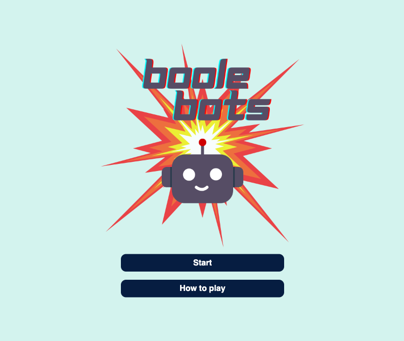
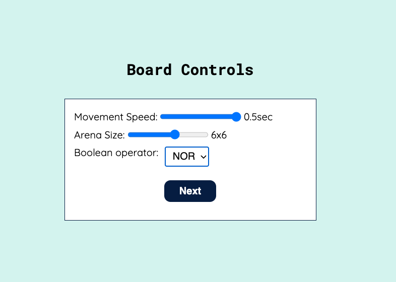
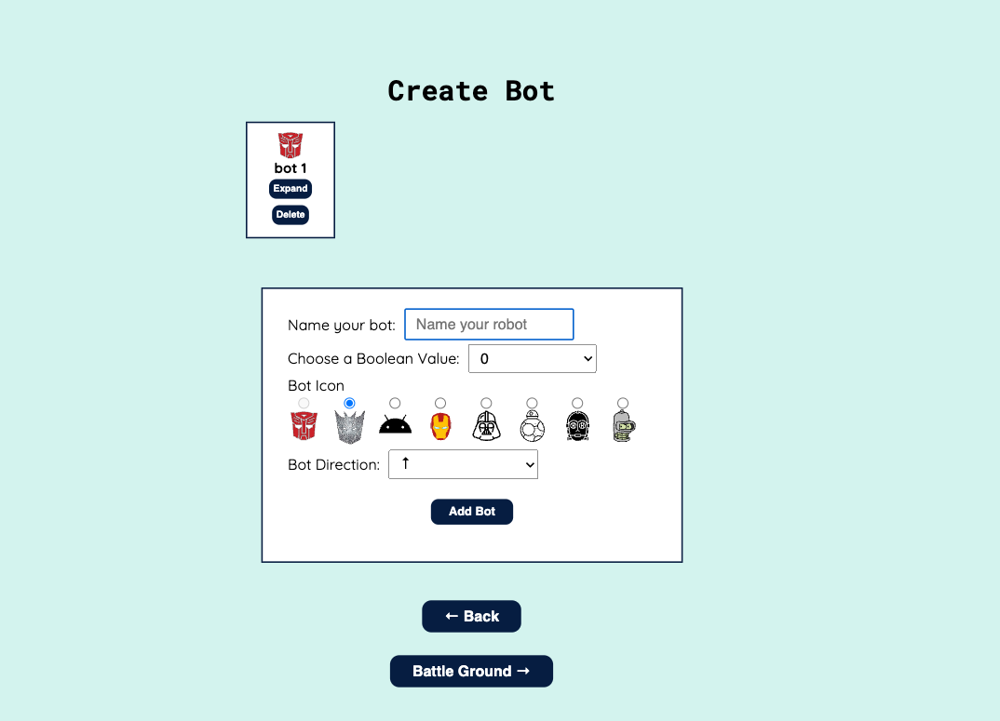
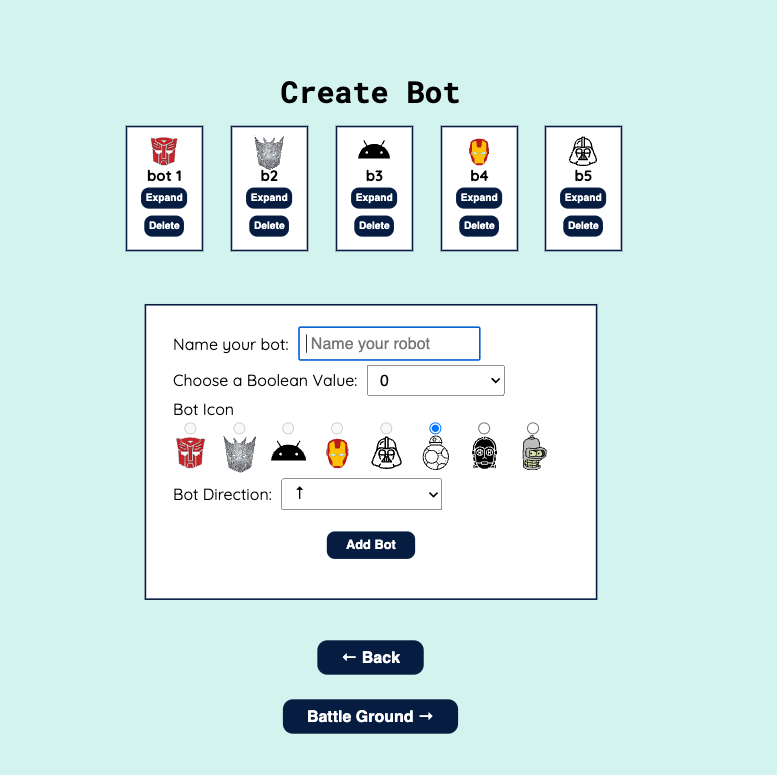
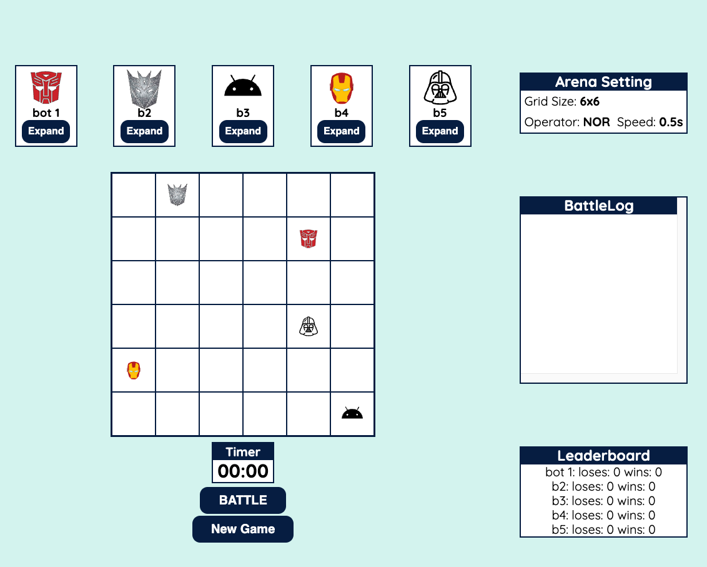
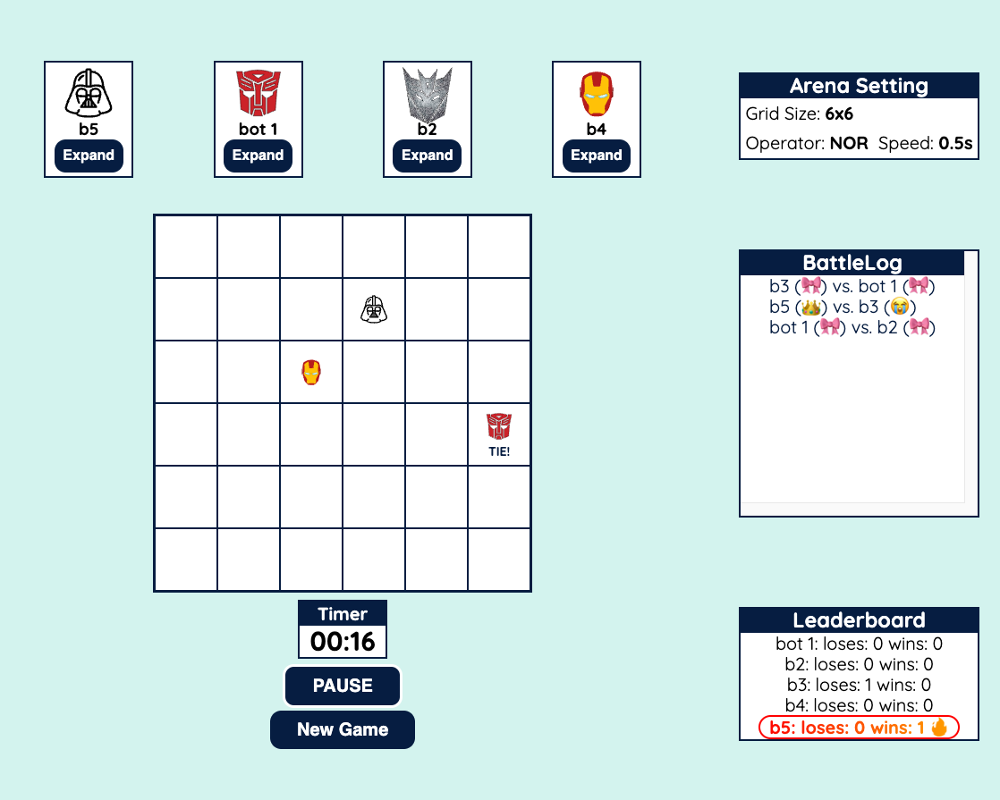

# BooleBots 
BooleBots is an engaging app that combines gameplay with basic Boolean logic.
(Boolebot is a Tier-2 [Chingus](https://jack-codes.netlify.app/) Project)
[Live Site](https://boolebots-dev.netlify.app/)

A collaborative app built remotely by:
- Run Qi (Jack) Li | [Github](https://github.com/jackli921) | [Portfolio](https://jack-codes.netlify.app/)
- Elizabeth Reeves | [Github](https://github.com/libbyreeves) | [Portfolio](https://elizabeth-reeves.ca/)
- Hector Garcia | [Github](https://github.com/hectorgarcia07) | [LinkedIn](https://www.linkedin.com/in/hectorgarcia01/)
- Sucheta Mukherjee| [Github](https://github.com/sucheta90) | [LinkedIn](https://www.linkedin.com/in/sucheta-mukherjee-07347b88/)


## Overview
Boole Bots is a game that is not only fun, but also an aid in helping to understand basic Boolean logic. This game has an arena of 8x8 game tiles in which your bots move at random speeds and trajectories. The Bots are assigned boolean values of 0 or 1 and boolean operations - AND, OR, NOR, NOT.

<div align="center">

</div>


## Features
- Arena configuration panel (bot movement speed, arena dimension, boolean operator)
- Bot configuration panel (bot name, boolean value, bot icon, bot direction)
- Leaderboard showing bots scores
- Battle Log showing all which bots battled and who won and lost 
- Game controls (STOP vs. BATTLE)
- Arena can have a max size of 8 x 8 and arena size can be customizable
- Bots can move any North, West, South, East, North West, North East, South West, South East
- User can reset game using previous saved game state
- User can restart a game 


## Technologies
- React.js
- Git/Github
- SASS
- Vite
- Sweet Alert

## Dependencies
- [Sweet Alert](https://sweetalert2.github.io/)
- [Sass](https://www.npmjs.com/package/sass)
- [react](https://www.npmjs.com/package/react)  
- [react-dom](https://www.npmjs.com/package/react-dom)
- [react-hook-form](https://www.npmjs.com/package/react-hook-form)
- [react-router-dom](https://www.npmjs.com/package/react-router-dom)
- [web-vitals](https://www.npmjs.com/package/web-vitals)


## Image Asset Credits
- [icon8] (https://icons8.com/)
- [iconscout] (https://iconscout.com/icons/transformers?price=free)
- [fontawesome] (https://fontawesome.com/icons/android?f=brands&s=solid)

## Improvements
- Use Redux for state management
- Refactor form logic

## Installation
To run this project locally:
1. Clone this project locally 
2. ```cd``` to ```Boolebot``` directory
3. run ```npm install``` to install dependencies 
4. run ```npm run dev``` to build the app locally


## Screenshots
<table>
  <tr>
     <td></td>
     <td></td>
     <td></td>
     <td></td>
     <td></td>
     <td></td>
  </tr>
</table>
